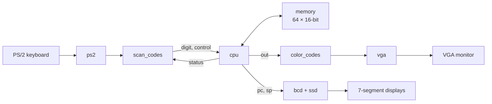

# PicoComputer CPU on FPGA

A 16-bit processor for the picoComputer instruction set, written in Verilog and targeting the Terasic **DE0** board (Altera Cyclone III). Programs read numbers typed on a **PS/2 keyboard** and show results as colors on a **VGA monitor**. The PC and SP are shown on the seven-segment displays.

Built for a VLSI design course at the University of Belgrade, School of Electrical Engineering, in three phases:

| Phase | What was built | Files |
| --- | --- | --- |
| 1. Simulation | 4-bit ALU and register, with a testbench that tries all 2048 ALU input combinations and drives the register randomly | `src/simulation/` |
| 2. Synthesis | The CPU (a finite-state machine), memory, clock divider, 7-segment output, PS/2 keyboard and VGA controllers | `src/synthesis/` |
| 3. Verification | A UVM testbench for the register: sequence, driver, monitor, agent and a scoreboard with a reference model | `src/simulation/top.sv` |

## Architecture



- `cpu` and `memory` run on a slow clock from `clk_div`, so execution can be followed by eye. The keyboard and VGA logic run at 50 MHz.
- **Input is blocking.** On `IN`, the CPU raises `status` and waits. `scan_codes` takes the next released digit key (0–9) and holds `control` high until the CPU has read the value. This is a two-signal handshake between the two parts.
- `ps2` passes the keyboard clock through a 3-flip-flop synchronizer and shifts in 11-bit frames (start, 8 data bits, parity, stop).
- `vga` produces 640×480 at 60 Hz (a 25 MHz pixel clock from 50 MHz). The output value (0–63) is shown as two colors: the left half of the screen is the tens digit and the right half is the ones digit.
- LEDs: `LEDG[4:0]` show the lower 5 bits of the output and `LEDG[5]` lights up while the CPU waits for input.

## CPU

- Multi-cycle design controlled by a finite-state machine: fetch, operand address (direct or indirect), operand read, execute, write back.
- 16-bit data and 6-bit addresses (64 words of memory). PC, SP, MAR, MDR, A and IR are all instances of one parameterized `register` module.
- After reset, PC = 8 and SP = 63.

Instruction format: `[15:12]` opcode, then three operands. Each operand is an indirect bit plus a 3-bit address (`[11:8]`, `[7:4]`, `[3:0]`).

| Opcode | Instruction | Operation |
| --- | --- | --- |
| `0000` | `MOV x, y` | x ← y |
| `0001` | `ADD x, y, z` | x ← y + z |
| `0010` | `SUB x, y, z` | x ← y − z |
| `0011` | `MUL x, y, z` | x ← y × z |
| `0100` | `DIV` | skipped (no-op) |
| `0111` | `IN x` | x ← digit typed on the keyboard (waits for input) |
| `1000` | `OUT x` | output ← x |
| `1111` | `STOP x, y, z` | outputs each non-zero operand, then halts |

## Demo program

`tooling/mem_init.mif` is loaded into memory at startup. If you type 8, 9 and 3, it outputs 8, 16, 7 and 21:

| Address | Code | Instruction | Result |
| --- | --- | --- | --- |
| 8 | `7101` | `IN A` | A = 8 |
| 9 | `8101` | `OUT A` | 8 |
| 10 | `0210` | `MOV B, A` | B = 8 |
| 11 | `1312` | `ADD C, A, B` | C = 16 |
| 12 | `8301` | `OUT C` | 16 |
| 13 | `7401` | `IN D` | D = 9 |
| 14 | `2334` | `SUB C, C, D` | C = 7 |
| 15 | `0530` | `MOV E, C` | E = 7 |
| 16 | `8501` | `OUT E` | 7 |
| 17 | `7301` | `IN C` | C = 3 |
| 18 | `3553` | `MUL E, E, C` | E = 21 |
| 19 | `8501` | `OUT E` | 21 |
| 20 | `F000` | `STOP` | halt |

`tooling/mem_init_monitor.mif` is a two-instruction program that outputs 21 without any keyboard input, useful for checking the VGA output on its own.

## Building and simulating

The build scripts are in `tooling/`. Set the Quartus and ModelSim/Questa paths at the top of `tooling/makefile`, then run from the `tooling` folder:

```bash
./xpack/bin/make simul_all    # compile and simulate
./xpack/bin/make synth_all    # synthesis, place & route, timing analysis
./xpack/bin/make synth_pgm    # program the board
```

The files to simulate are listed in `tooling/config/list-src-files-simul.lst`:

- **Phase 1 testbench:** `src/simulation/modules/alu.v`, `src/simulation/modules/register.v`, `src/simulation/top.v`
- **UVM testbench (phase 3):** `src/simulation/modules/register.v`, `src/simulation/top.sv`. This needs Questa, so set `SIMUL_IS_QUESTA_USED = 1`.

## Project structure

```
.
├── src/
│   ├── simulation/
│   │   ├── modules/          # 4-bit ALU and register (phase 1)
│   │   ├── top.v             # phase 1 testbench
│   │   └── top.sv            # UVM testbench (phase 3)
│   └── synthesis/
│       ├── modules/          # cpu, memory, alu, register, clk_div, ps2,
│       │                     # scan_codes, vga, color_codes, bcd, ssd, ...
│       ├── DE0_TOP.v         # board top-level (DE0, Cyclone III)
│       └── DE0_CV_TOP.v      # board top-level (DE0-CV, Cyclone V)
└── tooling/
    ├── makefile
    ├── mem_init.mif          # demo program
    ├── mem_init_monitor.mif  # VGA-only demo
    ├── config/               # file lists, pin assignments, simulation scripts
    └── xpack/                # make and shell tools for Windows
```

The build tooling (makefile, board configuration, `xpack`) and the board top-level templates were provided by the course. Terasic files keep their original license headers.
